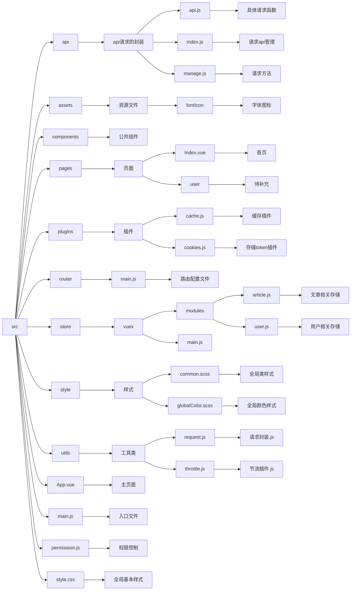

## 开发规范

#### 命名规范

函数或方法及文件： 开头字母不用大写第二个单词首字母必须大写 如 `userName`

类： 全部单词首字母必须大写 如`UserName`

#### 页面开发

样式颜色尽量从全局颜色样式中调用方便统一网站色调 如案例`Index.vue`中的`color: $primary-color` 

**注意：**style标签需加上`lang=”scss“`才能使用全局样式 

每个页面的样式写在style文件夹中 如Index.css 

开发页面时将路由配置文件中` component: () => import("../pages/Index.vue")`  import的路径改为自己写的页面路径 **提交时仅提交自己负责的页面和样式文件** 避免多人开发提交混乱

#### 运行及baseUrl说明

打开项目后使用 `npm i` 命令初始化 之后使用`npm run test`命令运行项目

现未接入后端 若要修改在.env.test文件中修改`VITE_APP_BASE_API`

## 文件结构

## 

